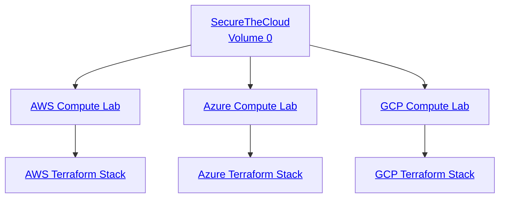

<div align="center">

# 

### **SecureTheCloud Academy**
#### *Multi-Cloud Zero Trust • Cloud Security • Enterprise Architecture*
🔗 **https://SecureTheCloud.dev**  
📺 **https://www.youtube.com/@SecureTheCloud-dev**

---

</div>

# 🌍 **Volume 0 — Multi-Cloud Compute Architecture (AWS • Azure • GCP)**  
### *Start here before ANY other SecureTheCloud courses.*

This is the **foundational blueprint** for every SecureTheCloud student or professional.  
It must be completed **before** Identity Layer, Zero Trust, SIEM, or advanced architectures.

---

# 🧭 **📚 Course Navigation (Chronological)**  
> 🔥 **You MUST follow the sequence.**  
Each volume is a dependency for the next.

### **Start → Volume 0 (THIS repo)**  
✔ AWS + Azure + GCP Compute Foundations  
✔ Zero Trust network layer  
✔ Terraform multi-cloud IaC  
✔ Cross-cloud architectural symmetry

---

### **Next → Volume 1**  
🔐 **AWS IAM Identity Center ↔ Microsoft Entra ID (Zero Trust Identity Layer)**  
*Repo link will appear here once created.*

### **Then → Volume 2**  
🟦 **GCP Workforce Identity Federation**  

### **Then → Volume 3**  
🟪 **Azure Conditional Access + Identity Protection (Zero Trust Policies)**  

### **Then → Volume 4**  
🛡️ **Multi-Cloud SIEM & Monitoring Integration**  

*(And so on — SecureTheCloud curriculum is fully modular and scalable.)*

---

# 📂 **📁 Repository Structure (Collapsible + Clickable)**

<details>
<summary><strong>📁 /diagrams</strong> — Architecture Visuals</summary>

- [securethecloud-banner.png](diagrams/securethecloud-banner.png)
- [securethecloud-logo.png](diagrams/securethecloud-logo.png)
- [multi-cloud-topology.mmd](diagrams/multi-cloud-topology.mmd)
- [aws-network.mmd](diagrams/aws-network.mmd)
- [azure-network.mmd](diagrams/azure-network.mmd)
- [gcp-network.mmd](diagrams/gcp-network.mmd)

</details>

---

<details>
<summary><strong>📘 /theory</strong> — Chapters (Read in Order)</summary>

1. [01 — Introduction to Multi-Cloud Architecture](theory/01-introduction.md)  
2. [02 — AWS Compute Architecture](theory/02-aws-architecture.md)  
3. [03 — Azure Compute Architecture](theory/03-azure-architecture.md)  
4. [04 — GCP Compute Architecture](theory/04-gcp-architecture.md)  
5. [05 — Zero Trust Network Principles](theory/05-zero-trust-principles.md)  
6. [06 — Terraform Infrastructure Patterns](theory/06-terraform-infrastructure.md)  
7. [07 — Multi-Cloud Networking Patterns](theory/07-multi-cloud-networking.md)  

</details>

---

<details>
<summary><strong>🧪 /labs</strong> — Hands-On Labs (Do in Order)</summary>

1. [01 — AWS Compute Deployment Lab](labs/01-aws-lab.md)  
2. [02 — Azure Compute Deployment Lab](labs/02-azure-lab.md)  
3. [03 — GCP Compute Deployment Lab](labs/03-gcp-lab.md)  
4. [04 — Multi-Cloud Validation Lab](labs/04-validation-lab.md)  

</details>

---

<details>
<summary><strong>🛠️ /terraform</strong> — Full IaC Structure</summary>

- **modules/**
  - [aws-network](terraform/modules/aws-network/)
  - [aws-vm](terraform/modules/aws-vm/)
  - [azure-network](terraform/modules/azure-network/)
  - [azure-vm](terraform/modules/azure-vm/)
  - [gcp-network](terraform/modules/gcp-network/)
  - [gcp-vm](terraform/modules/gcp-vm/)

- **stacks/**
  - [multi-cloud-aws](terraform/stacks/multi-cloud-aws/)
  - [multi-cloud-azure](terraform/stacks/multi-cloud-azure/)
  - [multi-cloud-gcp](terraform/stacks/multi-cloud-gcp/)
  - [variables.tf](terraform/stacks/variables.tf)

</details>

---

# 🗺️ **Interactive Multi-Cloud Diagram (Clickable Nodes)**



🧠 What You Learn in Volume 0
✔ Multi-cloud compute symmetry
✔ Zero Trust network segmentation
✔ VPC/VNet architecture fundamentals
✔ Address planning and subnetting
✔ Firewall, SG, NSG, ACL schemas
✔ Terraform multi-cloud IaC patterns
✔ Infrastructure consistency across AWS/Azure/GCP
✔ Cloud-native differences & alignment
✔ Preparing the foundation for identity federation (Volume 1)
🎓 After Volume 0 — Start Volume 1
➡️ Volume 1 — AWS IAM Identity Center ↔ Microsoft Entra ID Federation
This is where your multi-cloud identity entity begins.

(Link will be inserted once the repo is created.)

<div align="center">
SecureTheCloud.dev
The Next Generation of Cloud Security Education.

</div> ```
