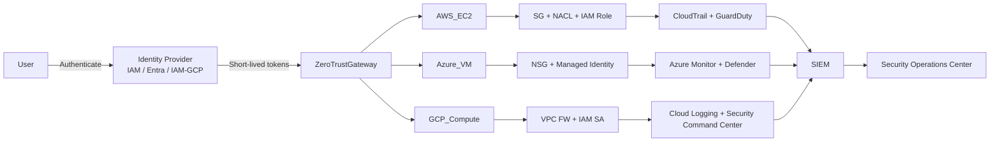

<!-- ========================================================= -->
<!-- =============== SECURETHECLOUD BANNER =================== -->
<!-- ========================================================= -->

  

<h1 align="center">🌐 Multi-Cloud Compute Architecture</h1>

  AWS • Azure • GCP • Zero-Trust • Terraform • Secure Automation

---

<!-- ========================================================= -->
<!-- ======================== BADGES ========================= -->
<!-- ========================================================= -->

  
  
  

  <!-- Cloud Providers -->
  
  
  

  <!-- Tools -->
  

  <!-- Brand -->
  

---

<!-- ========================================================= -->
<!-- ================== NAVIGATION BUTTONS =================== -->
<!-- ========================================================= -->

  

  

  

  

  

---

# 📦 Repository Tree

<strong>📁 Click to Expand Repository Tree</strong>

 

📦 **multi-cloud-compute-architecture**

├── 📄 [README.md](README.md)  
├── 🧰 [multicloud_run.sh](multicloud_run.sh)  
├── 📝 [variables.tf](variables.tf)  
├── 📝 [outputs.tf](outputs.tf)  

---

### 🔧 automation/
├── 📂 [automation/aws](automation/aws/)  
│   └── 🏃 [run_lab.sh](automation/aws/run_lab.sh)  
├── 📂 [automation/azure](automation/azure/)  
│   └── 🏃 [run_lab.sh](automation/azure/run_lab.sh)  
├── 📂 [automation/gcp](automation/gcp/)  
│   └── 🏃 [run_lab.sh](automation/gcp/run_lab.sh)  
└── 📂 [automation/common](automation/common/)  
    ├── ⚙️ [backend.sh](automation/common/backend.sh)  
    ├── 🧾 [logger.sh](automation/common/logger.sh)  
    └── 🔍 [validator_core.sh](automation/common/validator_core.sh)  

---

### 📚 docs/
├── 📂 [docs/architecture](docs/architecture/)  
│   ├── 🧩 [multi-cloud-diagram.md](docs/architecture/multi-cloud-diagram.md)  
│   ├── 🛰️ [aws-network.md](docs/architecture/aws-network.md)  
│   ├── 🔷 [azure-network.md](docs/architecture/azure-network.md)  
│   ├── 🌐 [gcp-network.md](docs/architecture/gcp-network.md)  
│   └── 🛡️ [zero-trust-overview.md](docs/architecture/zero-trust-overview.md)  
├── 📂 [docs/theory](docs/theory/)  
│   ├── 📘 [compute-basics.md](docs/theory/compute-basics.md)  
│   ├── 🔐 [zero-trust-concepts.md](docs/theory/zero-trust-concepts.md)  
│   └── 🌍 [terraform-basics.md](docs/theory/terraform-basics.md)  
└── 📂 [docs/binder](docs/binder/)  
    └── 📄 *(future PDF exports)*  

---

### 🏗 terraform/
├── 📂 [terraform/modules](terraform/modules/)  
│   ├── 📂 [aws-ec2](terraform/modules/aws-ec2/)  
│   │   ├── 📝 [main.tf](terraform/modules/aws-ec2/main.tf)  
│   │   ├── 📝 [variables.tf](terraform/modules/aws-ec2/variables.tf)  
│   │   └── 📝 [outputs.tf](terraform/modules/aws-ec2/outputs.tf)  
│   ├── 📂 [aws-network](terraform/modules/aws-network/)  
│   │   ├── 📝 [main.tf](terraform/modules/aws-network/main.tf)  
│   │   ├── 📝 [variables.tf](terraform/modules/aws-network/variables.tf)  
│   │   └── 📝 [outputs.tf](terraform/modules/aws-network/outputs.tf)  
│   ├── 📂 [azure-vm](terraform/modules/azure-vm/)  
│   │   ├── 📝 [main.tf](terraform/modules/azure-vm/main.tf)  
│   │   ├── 📝 [variables.tf](terraform/modules/azure-vm/variables.tf)  
│   │   └── 📝 [outputs.tf](terraform/modules/azure-vm/outputs.tf)  
│   ├── 📂 [azure-network](terraform/modules/azure-network/)  
│   │   ├── 📝 [main.tf](terraform/modules/azure-network/main.tf)  
│   │   ├── 📝 [variables.tf](terraform/modules/azure-network/variables.tf)  
│   │   └── 📝 [outputs.tf](terraform/modules/azure-network/outputs.tf)  
│   ├── 📂 [gcp-compute](terraform/modules/gcp-compute/)  
│   │   ├── 📝 [main.tf](terraform/modules/gcp-compute/main.tf)  
│   │   ├── 📝 [variables.tf](terraform/modules/gcp-compute/variables.tf)  
│   │   └── 📝 [outputs.tf](terraform/modules/gcp-compute/outputs.tf)  
│   └── 📂 [gcp-network](terraform/modules/gcp-network/)  
│       ├── 📝 [main.tf](terraform/modules/gcp-network/main.tf)  
│       ├── 📝 [variables.tf](terraform/modules/gcp-network/variables.tf)  
│       └── 📝 [outputs.tf](terraform/modules/gcp-network/outputs.tf)  

├── 📂 [terraform/stacks](terraform/stacks/)  
│   └── 📂 [multi-cloud-deployment](terraform/stacks/multi-cloud-deployment/)  
│       ├── 📝 [main.tf](terraform/stacks/multi-cloud-deployment/main.tf)  
│       ├── 📝 [variables.tf](terraform/stacks/multi-cloud-deployment/variables.tf)  
│       └── 📝 [outputs.tf](terraform/stacks/multi-cloud-deployment/outputs.tf)  

---

### 🧪 logs/
└── 📄 [run-YYYYMMDD-HHMMSS.log](logs/)

---

# 📘 Theory Modules

---

# 🧪 Multi-Cloud Hands-On Labs

---

# 🏗 Terraform Architecture Navigation

---

# 🔐 Zero-Trust Multi-Cloud Architecture (Mermaid)

