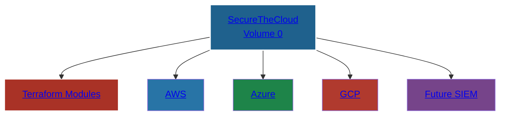

# diagrams/identity-banner.png

### **SecureTheCloud Academy**
#### Multi-Cloud Zero Trust • Cloud Security Engineering • Enterprise Architecture

🔗 **https://SecureTheCloud.dev**  
📺 **https://www.youtube.com/@SecureTheCloud-dev**

---

# 🌍 **Volume 0 — Multi-Cloud Compute Architecture (AWS • Azure • GCP)**  
### *The Foundation of the SecureTheCloud Academy*

Welcome to **Volume 0**, the official starting point of the SecureTheCloud curriculum.  
Every learner — from beginner to senior cloud architect — must complete this volume **before** any Zero Trust, Identity Federation, SIEM, or cross-cloud architecture courses.

This volume establishes:

- **Symmetrical compute foundations** across AWS, Azure, and GCP  
- **Zero Trust network baselines**  
- **Terraform-driven multi-cloud deployments**  
- **Modular infrastructure as code patterns**  
- **Foundational architecture for future volumes**

This is the *root* of your entire multi-cloud engineering skillset.

---

# 🧭 **Course Navigation (Chronological)**

> 🔥 **Important:** SecureTheCloud volumes must be completed **in order**.  
> Each volume depends on the last.

### ✔ **Start here → Volume 0 (THIS repo)**  
You will deploy AWS, Azure, and GCP compute foundations with Terraform.

### ➡ **Next → Volume 1 — AWS IAM Identity Center ↔ Microsoft Entra Federation**  
https://github.com/S3curethecloud/multi-cloud-identity-aws-entra

### ➡ **Future → Volume 2 — GCP Workforce Identity Federation** *(coming soon)*  
### ➡ **Future → Volume 3 — Azure Conditional Access Zero Trust**  
### ➡ **Future → Volume 4 — Multi-Cloud SIEM Architecture**  
### ➡ **Future → Volume 5 — Multi-Cloud Compliance & Auditing**  
### ➡ **Future → Volume 6 — Multi-Cloud Network Mesh**  
### ➡ **Future → Volume 7 — Threat Detection & Identity Analytics**
### ➡ **Future - Volume 8 — Delta Airline Flight Operations Command Center

This repo acts as the **hub** for all SecureTheCloud courses.

---

# 📂 **Repository Structure (Collapsible + Clickable)**

<strong>📘 /theory — Required Reading</strong>

*This repo will soon include full theory chapters after cleanup.*

---

<strong>🧪 /labs — Hands-On Multi-Cloud Labs</strong>

*Labs exist in cloud-specific repos, linked below.*

- AWS Lab → Volume 1  
- Azure Lab → Volume 1  
- GCP Lab → Volume 1  

---

<strong>🛠️ /terraform — Full Multi-Cloud IaC</strong>

Contains all production-grade Terraform modules and stacks:

### Modules:
- [AWS Network](terraform/modules/aws-network/)
- [AWS EC2](terraform/modules/aws-ec2/)
- [Azure Network](terraform/modules/azure-network/)
- [Azure VM](terraform/modules/azure-vm/)
- [GCP Network](terraform/modules/gcp-network/)
- [GCP VM](terraform/modules/gcp-vm/)

### Stacks:
- [multi-cloud-aws](terraform/stacks/multi-cloud-aws/)
- [multi-cloud-azure](terraform/stacks/multi-cloud-azure/)
- [multi-cloud-gcp](terraform/stacks/multi-cloud-gcp/)
- [multi-cloud-deployment](terraform/stacks/multi-cloud-deployment/)

---

# 🗺️ **Interactive Multi-Cloud Diagram (Clickable Mermaid)**

This interactive diagram links directly into each cloud's Terraform stack.

🌐 What You Will Learn in This Volume
✔ AWS VPC, Subnets, Security Groups, EC2
✔ Azure VNets, Subnets, NSG Zero Trust, VMs
✔ GCP VPC, Firewall Rules, Compute Engine
✔ Terraform module design patterns
✔ Zero Trust network segmentation
✔ Multi-cloud networking symmetry
✔ How compute ties into identity (Volume 1)
✔ Cloud-native security enforcement
This forms the baseline of your Zero Trust multi-cloud architecture.

🪜 Prerequisites
Basic Terraform knowledge

Free-tier accounts in AWS, Azure, GCP

Local development environment (VS Code + Terraform CLI)

Completed Volume 1 repo setup

🧑‍💻 Who This Volume Is For
Cloud Architects

Security Engineers

DevOps / DevSecOps

SOC Analysts

Students pursuing cloud careers

Enterprise security professionals

This is the foundation of SecureTheCloud Academy.

🔗 Continue to Volume 1 — Identity Federation
🔐 AWS IAM Identity Center ↔ Microsoft Entra ID Federation
https://github.com/S3curethecloud/multi-cloud-identity-aws-entra

This is where your multi-cloud ZERO TRUST identity mesh begins.

© 2025 SecureTheCloud.dev — All Rights Reserved
Zero Trust • Multi-Cloud • Enterprise Architecture

Terms •
Privacy •
Status •
Community •
Docs

