<div align="center">

# 

### **SecureTheCloud Academy**
#### *Multi-Cloud Zero Trust • Cloud Security • Enterprise Architecture*
🔗 **https://SecureTheCloud.dev**  
📺 **https://www.youtube.com/@SecureTheCloud-dev**

---

</div>

# 🌍 **Volume 0 — Multi-Cloud Compute Architecture (AWS • Azure • GCP)**  
### *Start here before ANY other SecureTheCloud courses.*

This is the **foundational blueprint** for every SecureTheCloud student or professional.  
It must be completed **before** Identity Layer, Zero Trust, SIEM, or advanced architectures.

# 🧩 SecureTheCloud — Interactive Multi-Cloud System Map  

```mermaid
flowchart TD

%% =======================
%% MAIN ROOT
%% =======================
A["<a href='https://github.com/S3curethecloud/multi-cloud-compute-architecture'>SecureTheCloud<br/>Multi-Cloud Compute Architecture</a>"] 
    --> B["<a href='terraform/modules/'>Terraform Modules</a>"]

B --> C["<a href='terraform/stacks/multi-cloud-aws/'>AWS Architecture</a>"]
B --> D["<a href='terraform/stacks/multi-cloud-azure/'>Azure Architecture</a>"]
B --> E["<a href='terraform/stacks/multi-cloud-gcp/'>GCP Architecture</a>"]

%% =======================
%% SIEM (Future Volume)
%% =======================
A --> F["<a href='https://SecureTheCloud.dev'>Unified SIEM Platform (Future Volume)</a>"]

%% =======================
%% AWS SECTION
%% =======================
C --> C1["<a href='terraform/modules/aws-vm/'>AWS EC2 Module</a>"]
C --> C2["<a href='terraform/modules/aws-network/'>AWS Network<br/>Zero Trust SG</a>"]
C --> C3["<a href='labs/01-aws-lab.md'>AWS Application Load Balancer</a>"]
C --> C4["<a href='https://docs.aws.amazon.com/'>AWS Monitoring</a>"]
C --> C5["<a href='labs/04-validation-lab.md'>AWS SIEM Log Buckets</a>"]

C1 --> C1a["<a href='labs/01-aws-lab.md'>EC2 Instance<br/>Ubuntu 22.04</a>"]
C2 --> C2a["Zero Trust:<br/>Deny All Ingress<br/>Allow 443 Egress"]
C3 --> C3a["ALB Listener → Target Group"]
C4 --> C4a["CloudTrail · VPC Flow Logs<br/>GuardDuty · SecurityHub"]
C5 --> C5a["<a href='labs/04-validation-lab.md'>JSON · CLF · Parquet</a>"]

%% =======================
%% AZURE SECTION
%% =======================
D --> D1["<a href='terraform/modules/azure-vm/'>Azure VM Module</a>"]
D --> D2["<a href='terraform/modules/azure-network/'>Azure Network<br/>Zero Trust NSG</a>"]
D --> D3["<a href='labs/02-azure-lab.md'>Azure Load Balancer</a>"]
D --> D4["<a href='theory/03-azure-architecture.md'>Azure Monitoring</a>"]

D1 --> D1a["Linux VM"]
D2 --> D2a["Zero Trust:<br/>Deny All Inbound<br/>Allow 443 Outbound"]
D3 --> D3a["Public IP → Backend Pool LB"]
D4 --> D4a["Log Analytics<br/>Defender Alerts<br/>Diagnostics Logs"]

%% =======================
%% GCP SECTION
%% =======================
E --> E1["<a href='terraform/modules/gcp-vm/'>GCP Compute Engine Module</a>"]
E --> E2["<a href='terraform/modules/gcp-network/'>GCP Network<br/>Zero Trust Firewall</a>"]
E --> E3["<a href='labs/03-gcp-lab.md'>GCP HTTPS Load Balancer</a>"]
E --> E4["<a href='theory/04-gcp-architecture.md'>GCP Monitoring</a>"]

E1 --> E1a["e2-micro VM"]
E2 --> E2a["Zero Trust:<br/>Deny All Inbound<br/>Restrict Outbound"]
E3 --> E3a["Global HTTPS LB"]
E4 --> E4a["SCC Alerts<br/>VPC Flow Logs<br/>Audit Logs"]

%% =======================
%% SIEM PIPELINE (Clickable Soon)
%% =======================
F --> F1["<a href='https://SecureTheCloud.dev'>Promtail Agents</a>"]
F1 --> F2["<a href='https://SecureTheCloud.dev'>Loki Log Store</a>"]
F2 --> F3["<a href='https://SecureTheCloud.dev'>Grafana Dashboards</a>"]

%% LOG INGESTION PATHS
C5a --> F1
D4a --> F1
E4a --> F1

%% COLOR STYLES
style A fill:#1F618D,stroke:#fff,stroke-width:2px,color:white
style B fill:#A93226,stroke:#fff,color:white
style C fill:#2874A6,color:white
style D fill:#1E8449,color:white
style E fill:#B03A2E,color:white
style F fill:#76448A,color:white
style F1 fill:#BB8FCE,color:black
style F2 fill:#D7BDE2,color:black
style F3 fill:#E8DAEF,color:black
```




---

# 🧭 **📚 Course Navigation (Chronological)**  
> 🔥 **You MUST follow the sequence.**  
Each volume is a dependency for the next.

### **Start → Volume 0 (THIS repo)**  
✔ AWS + Azure + GCP Compute Foundations  
✔ Zero Trust network layer  
✔ Terraform multi-cloud IaC  
✔ Cross-cloud architectural symmetry

---

### **Next → Volume 1**  
🔐 **AWS IAM Identity Center ↔ Microsoft Entra ID (Zero Trust Identity Layer)**  
*Repo link will appear here once created.*

### **Then → Volume 2**  
🟦 **GCP Workforce Identity Federation**  

### **Then → Volume 3**  
🟪 **Azure Conditional Access + Identity Protection (Zero Trust Policies)**  

### **Then → Volume 4**  
🛡️ **Multi-Cloud SIEM & Monitoring Integration**  

*(And so on — SecureTheCloud curriculum is fully modular and scalable.)*

---

# 📂 **📁 Repository Structure (Collapsible + Clickable)**

<details>
<summary><strong>📁 /diagrams</strong> — Architecture Visuals</summary>

- [securethecloud-banner.png](diagrams/securethecloud-banner.png)
- [securethecloud-logo.png](diagrams/securethecloud-logo.png)
- [multi-cloud-topology.mmd](diagrams/multi-cloud-topology.mmd)
- [aws-network.mmd](diagrams/aws-network.mmd)
- [azure-network.mmd](diagrams/azure-network.mmd)
- [gcp-network.mmd](diagrams/gcp-network.mmd)

</details>

---

<details>
<summary><strong>📘 /theory</strong> — Chapters (Read in Order)</summary>

1. [01 — Introduction to Multi-Cloud Architecture](theory/01-introduction.md)  
2. [02 — AWS Compute Architecture](theory/02-aws-architecture.md)  
3. [03 — Azure Compute Architecture](theory/03-azure-architecture.md)  
4. [04 — GCP Compute Architecture](theory/04-gcp-architecture.md)  
5. [05 — Zero Trust Network Principles](theory/05-zero-trust-principles.md)  
6. [06 — Terraform Infrastructure Patterns](theory/06-terraform-infrastructure.md)  
7. [07 — Multi-Cloud Networking Patterns](theory/07-multi-cloud-networking.md)  

</details>

---

<details>
<summary><strong>🧪 /labs</strong> — Hands-On Labs (Do in Order)</summary>

1. [01 — AWS Compute Deployment Lab](labs/01-aws-lab.md)  
2. [02 — Azure Compute Deployment Lab](labs/02-azure-lab.md)  
3. [03 — GCP Compute Deployment Lab](labs/03-gcp-lab.md)  
4. [04 — Multi-Cloud Validation Lab](labs/04-validation-lab.md)  

</details>

---

<details>
<summary><strong>🛠️ /terraform</strong> — Full IaC Structure</summary>

- **modules/**
  - [aws-network](terraform/modules/aws-network/)
  - [aws-vm](terraform/modules/aws-vm/)
  - [azure-network](terraform/modules/azure-network/)
  - [azure-vm](terraform/modules/azure-vm/)
  - [gcp-network](terraform/modules/gcp-network/)
  - [gcp-vm](terraform/modules/gcp-vm/)

- **stacks/**
  - [multi-cloud-aws](terraform/stacks/multi-cloud-aws/)
  - [multi-cloud-azure](terraform/stacks/multi-cloud-azure/)
  - [multi-cloud-gcp](terraform/stacks/multi-cloud-gcp/)
  - [variables.tf](terraform/stacks/variables.tf)

</details>

---

# 🗺️ **Interactive Multi-Cloud Diagram (Clickable Nodes)**


🧠 What You Learn in Volume 0
```plaintext 
✔ Multi-cloud compute symmetry
✔ Zero Trust network segmentation
✔ VPC/VNet architecture fundamentals
✔ Address planning and subnetting
✔ Firewall, SG, NSG, ACL schemas
✔ Terraform multi-cloud IaC patterns
✔ Infrastructure consistency across AWS/Azure/GCP
✔ Cloud-native differences & alignment
✔ Preparing the foundation for identity federation (Volume 1)
🎓 After Volume 0 — Start Volume 1
➡️ Volume 1 — AWS IAM Identity Center ↔ Microsoft Entra ID Federation
This is where your multi-cloud identity entity begins.

(Link will be inserted once the repo is created.)

<div align="center">
SecureTheCloud.dev
The Next Generation of Cloud Security Education.

</div> ```
